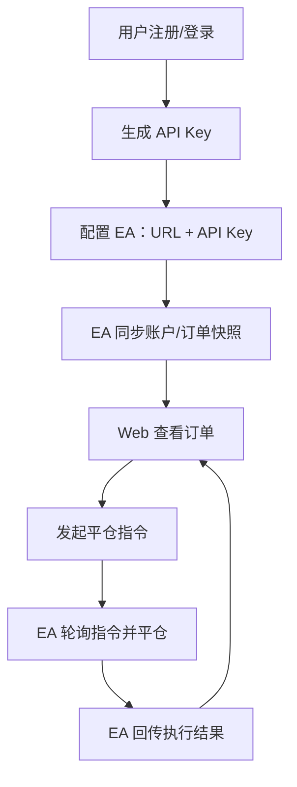

## 1. 产品概述
本项目包含两部分：MT5 端 EA（MQL5）与服务端 Web 程序（Python）。EA 将当前账号可见的账户信息与订单信息同步到服务端；Web 端提供注册登录、API Key 生成、订单查看与发起平仓指令。
- 目标用户：拥有一个或多个 MT5 账号、希望集中查看与远程发起平仓操作的交易者/团队
- 核心价值：多 MT5 账号订单聚合、可审计的远程平仓指令、API Key 管理与权限隔离

## 2. 核心功能

### 2.1 用户角色
| 角色 | 注册方式 | 核心权限 |
|------|----------|----------|
| 普通用户 | 邮箱 + 密码 | 登录、生成/管理 API Key、查看自己名下的 MT5 账号与订单、对订单发起平仓 |

### 2.2 功能模块
1. **EA（MQL5）同步器**：通过 WebRequest 上报账户信息与订单/持仓信息；轮询获取服务端指令并执行（平仓），回传执行结果
2. **服务端 API（Python）**：用户认证、API Key、接收 EA 同步、订单查询、下发平仓指令、记录审计日志
3. **Web 控制台（前端）**：注册/登录、API Key 管理、MT5 账号列表、订单列表与详情、发起平仓

### 2.3 页面与功能详情
| 页面名称 | 模块名称 | 功能描述 |
|---------|----------|----------|
| 登录/注册 | 表单 | 邮箱注册、登录、退出 |
| 控制台首页 | 概览卡片 | 展示 MT5 账号数量、最近同步时间、未完成指令数 |
| API Key 管理 | Key 列表 | 生成新 Key、查看 Key 的创建时间/最后使用时间、禁用/删除 Key |
| MT5 账号列表 | 账号表格 | 按 MT5 登录号/券商服务器分组，显示余额、净值、保证金、最后同步时间 |
| MT5 账号详情 | 订单/持仓列表 | 展示该 MT5 账号下的当前订单/持仓（与终端一致的关键字段），支持筛选/排序 |
| 订单详情 | 详情面板 | 展示订单/持仓的完整字段（ticket、symbol、volume、open price、sl/tp、profit、time 等） |

### 2.4 后台能力（非页面）
| 模块 | 功能描述 |
|------|----------|
| 同步接收 | EA 使用 API Key 鉴权，上报账户信息 + 当前订单/持仓快照 |
| 指令下发 | Web 用户对某个 ticket 发起平仓，服务端生成待执行指令 |
| 指令回执 | EA 执行平仓后回传结果（成功/失败、错误码/原因、执行时间） |
| 审计日志 | 记录谁在什么时间对哪个 MT5 账号的哪个 ticket 发起了什么操作，以及执行结果 |

## 3. 核心流程

### 3.1 用户侧流程
1. 用户注册并登录 Web 控制台
2. 用户生成 API Key
3. 用户在 MT5 中加载 EA，配置 Server URL 与 API Key，并将 URL 加入 MT5 允许的 WebRequest 列表
4. EA 周期性同步数据到服务端
5. 用户在 Web 控制台查看订单，并可对任意订单发起“平仓”
6. EA 轮询获取平仓指令并执行，服务端显示执行结果

### 3.2 EA 侧流程（周期任务）
1. 收集账户信息（余额、净值、保证金、货币、服务器、登录号等）
2. 收集“当前可见订单信息”（含持仓与挂单；字段以 MT5 API 可获取为准）
3. POST 到服务端：/api/v1/mt5/sync
4. GET 拉取待执行指令：/api/v1/mt5/actions?mt5_login=...
5. 对每个 close 指令执行交易请求；随后 POST 回执：/api/v1/mt5/action-results

## 4. 用户界面设计

### 4.1 设计风格
- 风格：深色金融仪表盘（高对比、强调数据密度与可读性）
- 主色：深灰/黑；强调色：青绿或橙色用于盈亏与操作按钮
- 字体：标题使用有辨识度的 Display 字体，正文使用易读的 Sans 字体
- 布局：顶部导航 + 左侧功能菜单，主体为卡片与表格，订单列表支持行内操作

### 4.2 页面设计概览
| 页面名称 | 模块名称 | UI 元素 |
|---------|----------|--------|
| 控制台首页 | 概览卡片 | 指标卡片、最近同步提示、异常提示条 |
| MT5 账号详情 | 订单表格 | 列可配置、筛选/搜索、盈亏颜色映射、平仓按钮（带二次确认） |
| API Key 管理 | Key 列表 | 生成按钮、复制按钮、禁用/删除操作、敏感信息遮罩 |

### 4.3 响应式
桌面优先；移动端保持核心可读性：表格改为卡片列表，关键指标优先展示。

