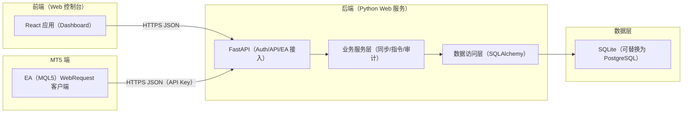
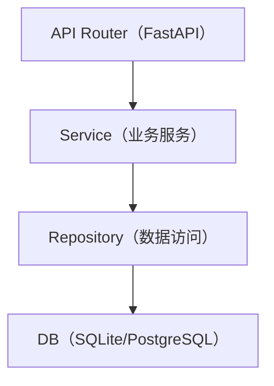
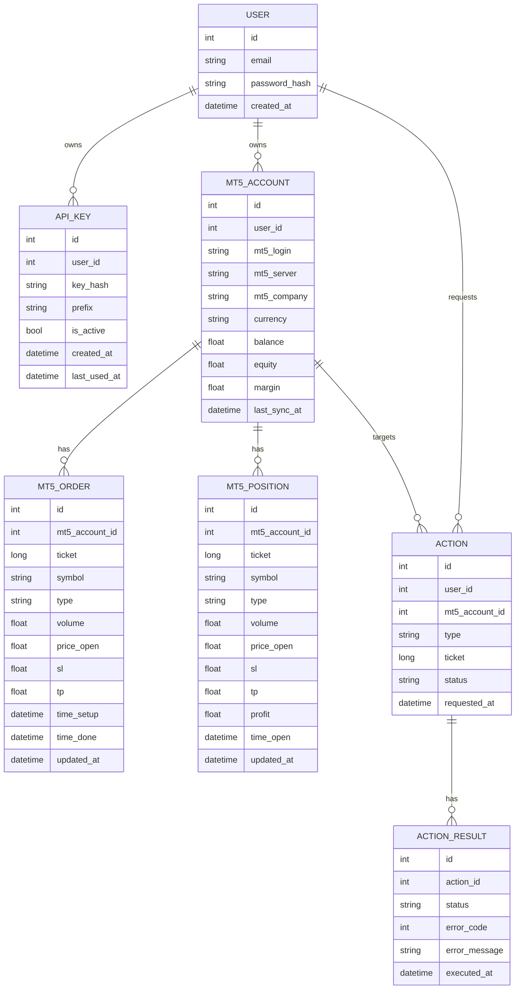

## 1. 架构设计

## 2. 技术选型说明
- 前端：React@18 + TypeScript + Vite + TailwindCSS
- 后端：Python + FastAPI + Uvicorn
- 认证：Web 使用 JWT（access token + refresh token）；EA 使用 API Key（仅用于 EA 接口）
- 数据库：SQLite（开发默认），可配置为 PostgreSQL
- 部署：单机部署（前端静态资源 + FastAPI），HTTPS 由反向代理（如 Nginx/Caddy）负责

## 3. 路由定义（前端页面）
| Route | 用途 |
|------|------|
| /login | 登录 |
| /register | 注册 |
| /dashboard | 概览 |
| /api-keys | API Key 管理 |
| /mt5-accounts | MT5 账号列表 |
| /mt5-accounts/:id | MT5 账号详情（订单/持仓） |

## 4. API 定义（后端）

### 4.1 认证与用户
- POST /api/v1/auth/register
- POST /api/v1/auth/login
- POST /api/v1/auth/refresh
- GET /api/v1/me

### 4.2 API Key 管理（登录态）
- GET /api/v1/api-keys
- POST /api/v1/api-keys
- POST /api/v1/api-keys/{id}/disable
- DELETE /api/v1/api-keys/{id}

### 4.3 EA 接入（API Key 鉴权）
- POST /api/v1/mt5/sync
  - 请求：{ mt5_account: {...}, positions: [...], orders: [...], sent_at }
  - 返回：{ ok: true }
- GET /api/v1/mt5/actions
  - 查询参数：mt5_login, mt5_server
  - 返回：{ actions: [ { id, type:"close", ticket, symbol, volume, requested_at } ] }
- POST /api/v1/mt5/action-results
  - 请求：{ action_id, status:"success"|"failed", error_code?, error_message?, executed_at }
  - 返回：{ ok: true }

### 4.4 订单与平仓（登录态）
- GET /api/v1/mt5-accounts
- GET /api/v1/mt5-accounts/{id}/orders
- GET /api/v1/mt5-accounts/{id}/positions
- POST /api/v1/orders/{order_id}/close
  - 行为：创建待执行 close 指令（不直接在服务端平仓）

## 5. 服务端分层结构图

## 6. 数据模型

### 6.1 ER 图

### 6.2 DDL（逻辑层）
后续实现以 ORM 迁移生成（Alembic），并添加索引：
- api_key(prefix)、mt5_account(user_id, mt5_login, mt5_server)、order(ticket)、position(ticket)、action(status, mt5_account_id)

